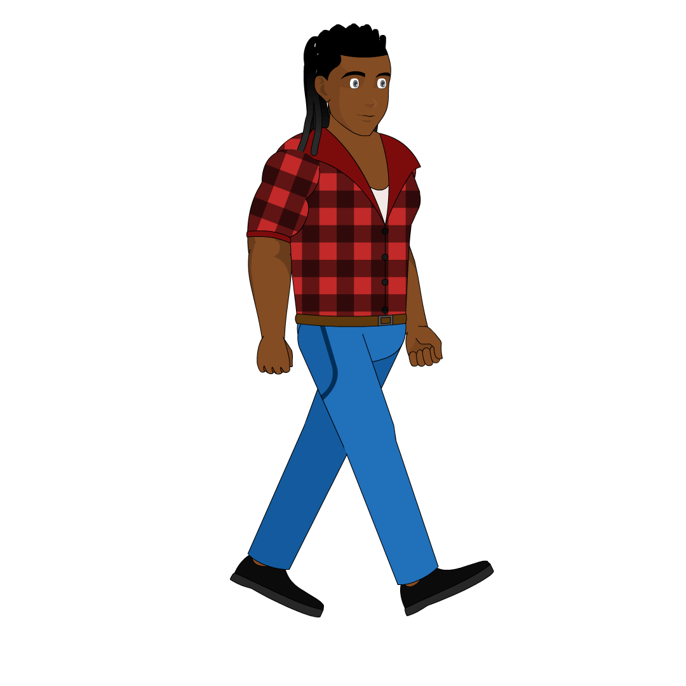

When I was called by a friend and asked if I’d like to teach a video game design class for Arts and Culture program for [IMAN (Inner-City Muslim Action Network)](https://www.imancentral.org/arts-culture/), I was elated and nervous. My background is primarily in web development, but would I be able to learn enough in a week to teach a 5 week class? **CHALLENGE ACCEPTED** 👏🏾.

### The Video Game Design Process

The first thing I needed to do was to get an understanding of the [video game design process](https://www.youtube.com/watch?v=SicZcaa-pRk). A Youtube video by [Game Dev Republic](https://www.youtube.com/channel/UCh3ovu0hkaI7_ACC8U2G0zg) provided an excellent starting point.

With my new understanding I knew I was going to have to relay this information to the students in a condensed format that could be easily understood. A [Powerpoint Presentation](https://docs.google.com/presentation/d/1XYEs2ivOp_ooHXST5k63Mxgh66iAjBcZsoqLXCTPPTY/edit#slide=id.g11647b37318_0_91) seemed like the best way to do this. We used this presentation to relearn concepts throughout the 5 week class.

The next thing I needed was to become familiar with a game development engine. I looked at Unity, Unreal Engine, Godot, Construct 3, and GameMaker. I have a little experience in Unity, however I knew that it was going to require scripting and knowledge of C#, and that wasn’t going to be easy to teach in a 5 week course. Construct 3 has an event system that can be learned without coding, and scripts can be written in Javascript which I believe is more approachable for a beginner. It also works in the browser which works nicely with my web development experience. The tradeoff with picking Construct 3 is that it is only able to create 2D games. I felt this was fine since 2D is a great starting point for beginners.

I quietly worked on the video game design process, and learning the game engine while waiting for the first day of class...

The First Day Of Class
========

I nervously took to the front of the class and let everyone take turns introducing themselves. After learning everyones comfort level with video game design, I decided that creating one game as a group would allow us to get a good idea of how the process works, and would give us the highest likelyhood on completing the game. 

Then I went into the PowerPoint presentation that explained the process we would be following.

> #### The process is simple
> 1. Writing
> 1. Art
> 1. Sound
> 1. Game Engine/Programming

I quickly learned that this process doesn't operate like a waterfall at all, and it's more of a dance **(1-2-3-4) (4-2-3-1)**.

We immediately got to work creating our game, starting with writing. We spent the entire first class creating this [document](https://docs.google.com/document/d/1gX7aZoQI8icJUiglj5nplUKlajwO4ycDm8pGknwhyvI/edit?usp=sharing) that breaks down the type of game we're making, the purpose, the characters and enemies. As well as the types of sounds we'd need, and what the characters should look like.

The Second Class
======

With our game design document fleshed out we headed to [Fiverr](https://www.fiverr.com/) to hire our artist. After reviewing the work of a bunch of different artists we decided to enlist [Agammaulidi](https://www.fiverr.com/agammaulidi/make-2d-animation-sprite-sheet-for-a-game?context_referrer=logged_in_homepage&source=recently_and_inspired&ref_ctx_id=0f7f8988fc4d25e3733b95140966e0ce&context=recommendation&pckg_id=3&pos=1&mod=hap%7Cpot&context_alg=recently_ordered&recommended_package_id=3&recommended_price=40000&tier_selection=recommended&imp_id=703a3777-0d47-4978-8f60-b83f050a386f) to our team.

We sent him descriptions of our characters and some proof of concepts and he immediately got to work.

After communicating with the artist throughout the week about what changes the students wanted to the characters
we we're able to get results.

<h1 style="text-align: center">Students</h1>

    <h3>Messiah</h3>
    

        

            <b>Characteristics: Studious, Athletic, Kind, distracted</b>
        

        

            <b>Appearance: Black, red/black dreads, all white, book in hand, tall</b>
        

    

    <h3>Mkeezy</h3>
    

        

            <b>Characteristics: Funny, Likes to write, smart guy, distracted</b>
        

        

            <b>Appearance: Colorful hair sharkboy as a concept, shortest</b>
        

    

    <h3>Slick Rick</h3>
    

        

            <b>Characteristics: Calm, Confident, Loyal, Sleepy</b>
        

        

            <b>Appearance: Husky, lofty eyes, black, jeans hoodie, ski mask</b>
        

    

    <h3>Crazy Legs</h3>
    

        

            <b>Characteristics: Hacker/Tech Savvy, Martial Artist, Arms Expert, Distracted</b>
        

        

            <b>Appearance: Suit, mute, james bond/john wick concept, African American</b>
        

    

    <h3>Lil Jay-z</h3>
    

        

            <b>Characteristics: Rebellious, Lucky, Problem Solver, Dependable</b>
        

        

            <b>Appearance: Long dreads, black, frown, jewelry, African American</b>
        

    

    <h3>Thumbs</h3>
    

        

            <b>Characteristics: Psychic, rich, mysterious, short-temper</b>
        

        

            <b>Appearance: All blue (like an avatar), red hands, colorful hair</b>
        

    

<h1 style="text-align: center">Case Workers</h1>

    <h3>Tina</h3>
    

        

            <b>Characteristics: Jack of all trades, leader, good counsel, violent</b>
        

        

            <b>Appearance: Bayonetta concept, burgundy hair</b>
        

    

    <h3>Kane</h3>
    

        

            <b>Characteristics: Rebellious, Lucky, Problem Solver, Dependable</b>
        

        

            <b>Appearance: Long dreads, black, frown, jewelry, African American</b>
        

    

Sounds
======

What's a video game without sound? Initially we planned to use websites like [Freesound](https://freesound.org/)
or [Sound Bible](https://soundbible.com/). Then I realized it would be much more engaging if the students got the
opportunity to create their own sounds.

#### Hit Sound
<audio controls>
  <source src="hit.mp3" type="audio/mpeg">
  Your browser does not support the audio tag.
</audio>

#### Dying Sound
<audio controls>
  <source src="dying.mp3" type="audio/mpeg">
  Your browser does not support the audio tag.
</audio>

We recorded it on an iPhone, so the quality was not the greatest. However, it allowed for a much more engaging experience.

